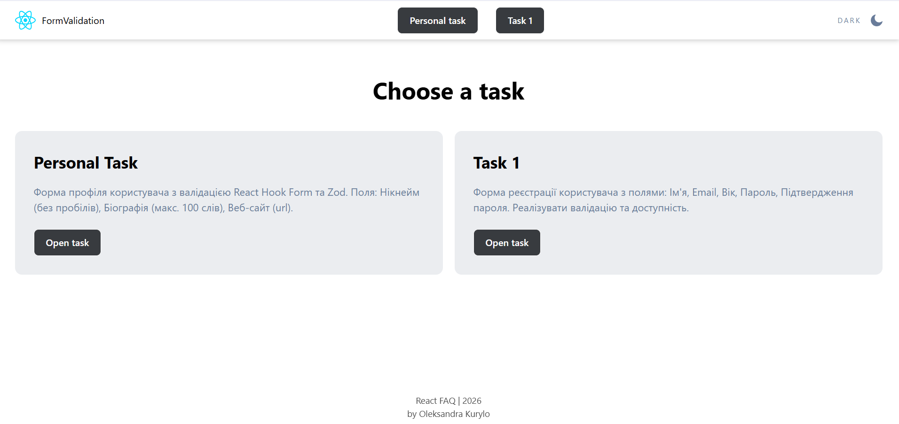

## Advanced Validation with React Hook Form & Zod



🔗 [Live Demo](https://advanced-validation.vercel.app/)

### 📝 Project Features

- React Form Management: Robust form handling using the React Hook Form library for optimal performance and minimal re-renders.

- Schema-based Validation: Comprehensive client-side data validation powered by Zod.

- Web Accessibility (A11y): Implementation of accessible web forms, ensuring screen reader compatibility and proper focus management.

### 🛠 Tech Stack

- Frontend: React

- Language: TypeScript

- Routing: React Router v6.4

- Styling: CSS Modules (for component-level style isolation)

- Forms: React Hook Form (efficient form state management)

- Validation: Zod (schema-based validation and type inference)

### 🗝️ Key Implementations

#### 1. User Profile Form (Individual Task)

- A personalized profile management form featuring:

- Nickname: Validated to ensure no spaces are allowed.

- Biography: Limited to a maximum of 100 words.

- Website: URL validation with automated protocol checks.

- Validation: Powered by a unified Zod schema and React Hook Form.

#### 2. User Registration Form

- A complete registration flow including the following fields:

- Full Name, Email, and Age.

- Password & Confirm Password: Includes cross-field validation to ensure passwords match.

- A11y & Validation: Fully accessible inputs with real-time error feedback for an enhanced user experience. Folder Structure

### 📂 Folder Structure

```text
src/
├── assets/          # Icons, images, and static media
├── components/      # Modular UI components
│   ├── Button/
│   ├── Header/
│   ├── MainLayout/
│   ├── RegisterForm/
│   ├── TaskCard/
│   ├── ThemeSwitcher/
│   └── UserProfileForm/
├── pages/           # Page-level components
│   ├── HomePage/
│   ├── NotFoundPage/
│   ├── RegisterFormPage/
│   └── UserProfileFormPage/
├── App.tsx          # Root application component
├── index.css        # Global styles
└── main.tsx         # Application entry point
```

### How to run a project locally

Open a terminal and run the command:

#### 1. Cloning a repository

```bash
git clone [https://github.com/AlexandraKurylo/React-labs.git](https://github.com/AlexandraKurylo/React-labs.git)
```

#### 2. Go to the project directory

```bash
   cd React-labs/Lab-5
```

#### 3. Installing dependencies

```bash
   npm install
```

#### 4. Launching the application

```bash
   npm run dev
```
