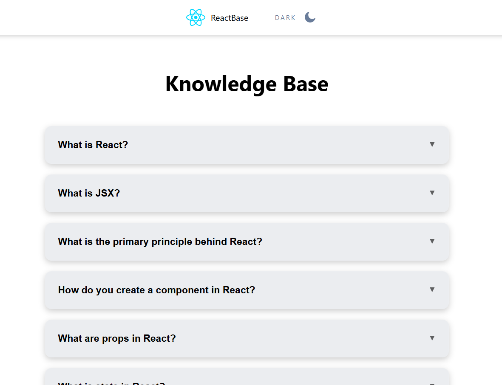

## 📝 React FAQ Application



Інтерактивний веб-додаток для перегляду відповідей на поширені запитання (FAQ), реалізований як Single Page Application (SPA) на базі React та TypeScript. Проєкт демонструє роботу з динамічним роутингом, станом компонентів та модульною стилізацією.

### 🚀 Функціональні можливості

- Інтерактивний список (Accordion): Зручний інтерфейс для перегляду списку питань з можливістю переходу до детальної інформації.

- Динамічний роутинг: Використання react-router-dom для навігації між головною сторінкою та сторінками окремих запитань без перезавантаження браузера.

- Детальні відповіді: Кожне питання має окрему сторінку з розширеним описом та корисними посиланнями на зовнішні ресурси.

- MainLayout: Використання єдиного шаблону (Layout) для збереження цілісності інтерфейсу (Header/Footer) на всіх сторінках.

### 🛠 Технологічний стек

- Frontend: React

- Мова: TypeScript (типізація пропсів, станів та об'єктів даних)

- Роутинг: React Router v6.4+ (useNavigate, useParams)

- Стилізація: CSS Modules (для ізоляції стилів компонентів)

- Дані: JSON-структура для зберігання контенту FAQ.

### 📂 Структура проєкту

- src/components — перевикористовувані UI-компоненти (MainLayout, Input, AccordionItem, QuestionDetail, Button, Header, ThemeSwitcher).

- src/pages — основні сторінки додатку (Home, QuestionPage, NotFoundPage).

- src/data — локальна база даних (db.json) із запитаннями.

\*MainLayout — компонент-обгортка, що забезпечує однакову структуру сторінок.

### Як запустити проект локально

Відкрийте термінал та виконайте команду:

#### 1. Клонування репозиторію

```bash
git clone [https://github.com/AlexandraKurylo/React-labs.git](https://github.com/AlexandraKurylo/React-labs.git)
```

#### 2. Перехід до директорії проекту

```bash
   cd React-labs/react-FAQ
```

#### 3. Встановлення залежностей

```bash
   npm install
```

#### 4. Запуск бази даних (Terminal 1)

```bash
   npm run server
```

#### 5. Запуск додатку (Terminal 2)

```bash
   npm run dev
```

#### 6. Можна запустити базу даних та додаток однією командою в одному терміналі

```bash
   npm run start:app
```
